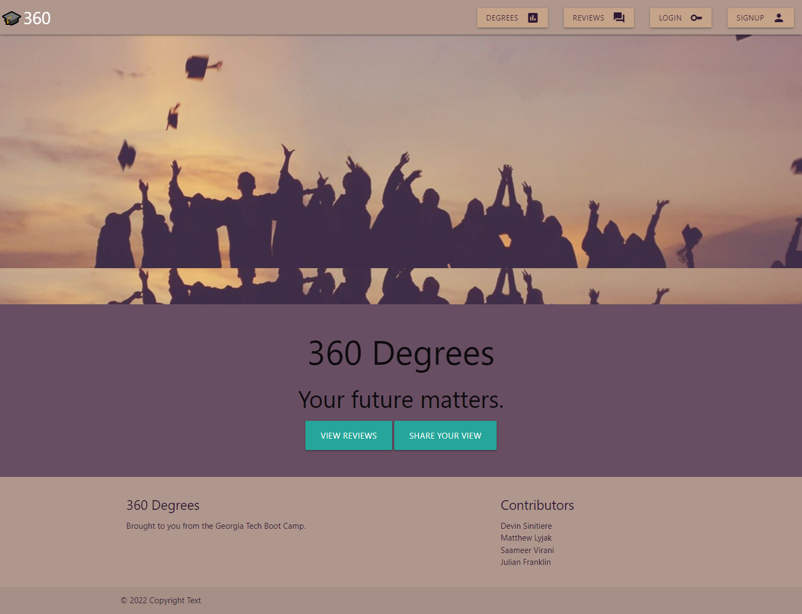

# 360 Degrees #

**Note:** This repository contains our source code for a full-stack web application created as part of GA Tech's 2022 Coding Bootcamp.

## Description ##

Have you ever been unsure of what degree you wanted to pursue? Were you worried about whether the time, effort, and money spent would be justified if you were to go into a particular field? 360 Degrees is here to help! With 360 Degrees users are able to rate and leave reviews for not just a particular class or teacher but for the entire degree program they pursued. Quickly and easily look up your degree and see what others have to say about it. Easily see others scores for the important questions such as: "Was the degree overall worthwhile?", "Was obtaining a career a quick endeavor after graduation?", and many more! If you're short on time you can look for the degree's aggregate review score which gives an overall idea of what users are saying about that particular degree program. Prepare to start your higher education journey confident and informed thanks to 360 Degrees!

## Technologies Used ##

* [NodeJS](https://nodejs.org/en/)
* [MySQL](https://www.mysql.com/) 
* [Sequelize](https://sequelize.org/)
* [ExpressJS](https://expressjs.com/)
* [HandlebarsJS](https://handlebarsjs.com/)
* [Materialize](https://materializecss.com/)
* [eslint](https://eslint.org/)
* [Heroku](https://heroku.com)

## Live Website ##

[Placeholder](https://threesixtydegrees.herokuapp.com/)

## Screenshot ##

